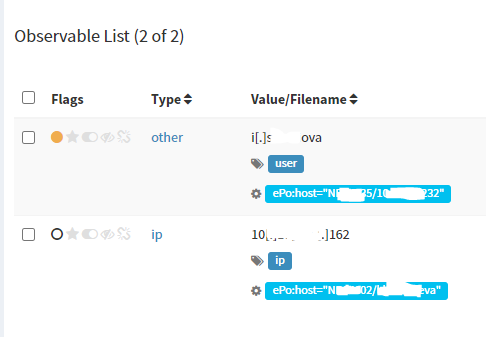
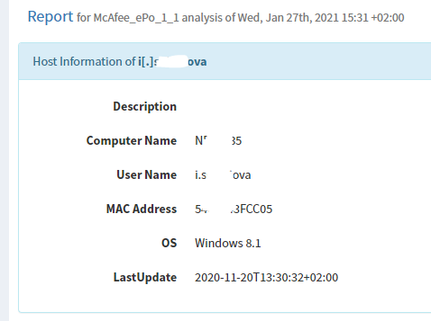

# McAfee-ePo-Analyser
An analyser for McAfee ePo with included report template. Retrieve key McAfee ePo information on an IP or username (sAMAccountName) strings.	

 

## Requirements
- McAfee ePo subscription
- McAfee ePo user/password (read role)

## Installation
### Analyzer
1. Open Cortex-Analyzers/analyzers/
2. Make a new Directory called "McAfeeEPO"
3. Copy the "mcafee_epo_analyzer.py", "McAfee_ePo.json" and "mcafee.py" files inside

### Template
1. Navigate to Cortex-Analyzers/thehive-templates/
2. Create a new folder called "McAfeeEPO_1_1"
3. Copy the "long.html" and "short.html" files there

## Configuration
1. Open Cortex,
2. Refresh your analysers
3. Enable "McAfee_ePo_1_1"
4. Input "hostname", "port, "user" and "password" of your McAfee ePo user. User should have read rights.
5. Save
6. Open TheHive
7. Go To "Report Templates"
8. "View Template" on Long Template for McAfee_ePo_1_1
9. Copy the contents of long.html and short.html in here and save.
10. Refresh your page.

## Notes
I use native mcafee.py lib as it supports current ePo 5.10.x. The analyser has some weakness, but it works fine for my general needs. Any help in coding is appreciated.
- A username can be found on a few machines were AV is installed. Analyser brings only last one.
- General code optimizating due to my superficial knowledge of python :)
- A lot of featueres could be added. For example, initiate AV scan on an endpoint. 
